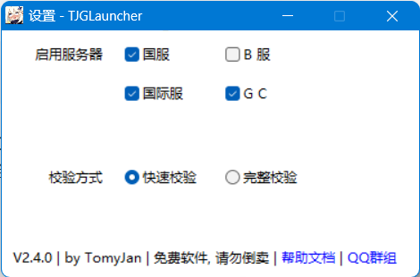

# ⏩ TJGL（Latest）

JGL**仅**提供最新版游戏的支持，旧版游戏将不会被正常识别！

前往此处下载TJGL→ [https://blog.tomys.top/2022-07/GenshinLauncher/](https://blog.tomys.top/2022-07/GenshinLauncher/) **以管理员身份启动**并等待资源下载


如果提示接触服务器失败但网络没有问题，那就多试几次（一般重开一次就好）


选择GC选项，填写服务器地址（对于本地服务器一般为 `127.0.0.1` 或 `localhost` ，能出现服务端版本号和当前在线人数说明服务器可用

<figure><figcaption></figcaption></figure>


如果主界面无GC选项，在设置中勾选GC并重启启动器即可



TJGL代理模块将会自动配置代理、完成补丁注入并启动游戏。


启动时游戏会出现与RSAPatch相同的行为，请**不要关闭**命令行窗口。

如果没有出现 `========== TJGL 正在引导游戏启动, 请勿关闭此窗口 ==========` 字样，请重启游戏和TJGL后重试。

如果似乎一切正常（如下图）但还是4214的话...中奖了 [手动配置RSAPatch](../manual/ying-yong-bu-ding/shi-yong-rsapatch3.1+.md)吧

.png>)

