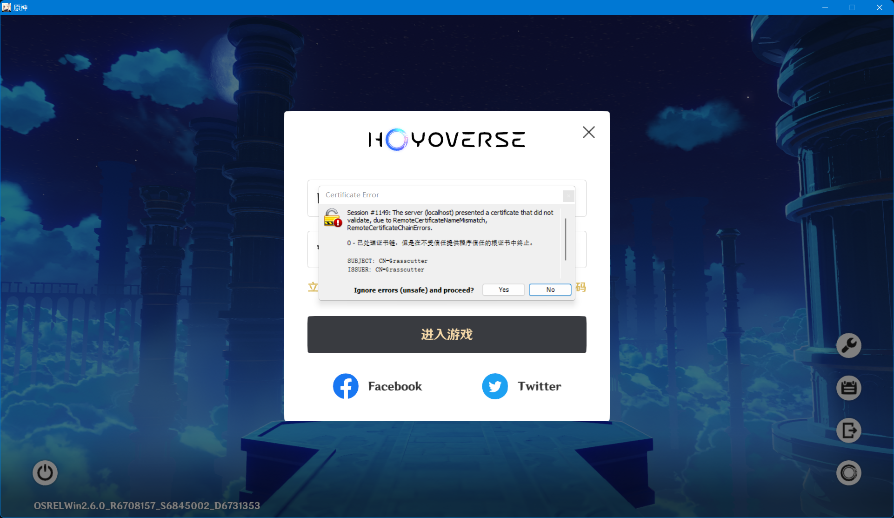
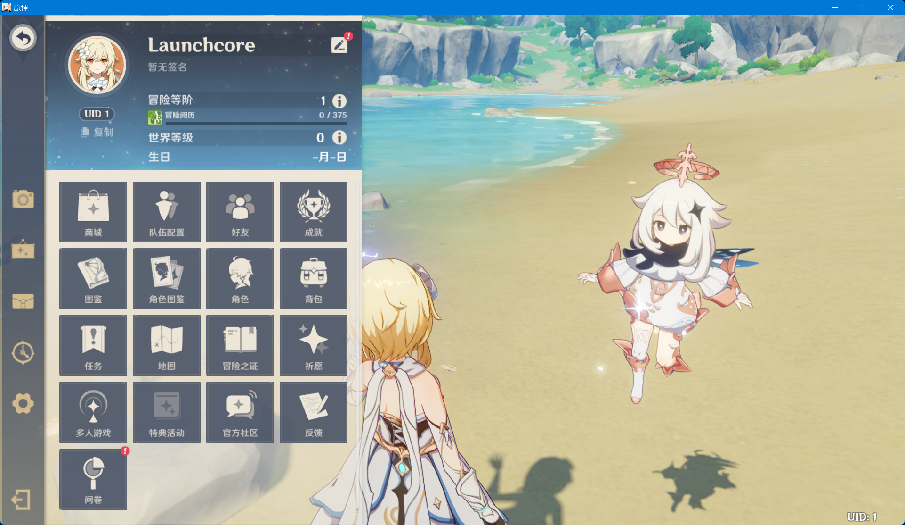

# 🧰 Fiddler Classic


请勿在 Fiddler Everywhere 上使用本方法（不支持Script）


安装启动Fiddler Classic后打开FiddlerScript，替换为如下内容：

```javascript
/* Original script by NicknameGG, modified for Grasscutter by contributors. */
import System;
import System.Windows.Forms;
import Fiddler;
import System.Text.RegularExpressions;
var list = [
    "https://api-os-takumi.mihoyo.com/",
    "https://hk4e-api-os-static.mihoyo.com/",
    "https://hk4e-sdk-os.mihoyo.com/",
    "https://dispatchosglobal.yuanshen.com/",
    "https://osusadispatch.yuanshen.com/",
    "https://account.mihoyo.com/",
    "https://log-upload-os.mihoyo.com/",
    "https://dispatchcntest.yuanshen.com/",
    "https://devlog-upload.mihoyo.com/",
    "https://webstatic.mihoyo.com/",
    "https://log-upload.mihoyo.com/",
    "https://hk4e-sdk.mihoyo.com/",
    "https://api-beta-sdk.mihoyo.com/",
    "https://api-beta-sdk-os.mihoyo.com/",
    "https://cnbeta01dispatch.yuanshen.com/",
    "https://dispatchcnglobal.yuanshen.com/",
    "https://cnbeta02dispatch.yuanshen.com/",
    "https://sdk-os-static.mihoyo.com/",
    "https://webstatic-sea.mihoyo.com/",
    "https://webstatic-sea.hoyoverse.com/",
    "https://hk4e-sdk-os-static.hoyoverse.com/",
    "https://sdk-os-static.hoyoverse.com/",
    "https://api-account-os.hoyoverse.com/",
    "https://hk4e-sdk-os.hoyoverse.com/" // Line 24
    ];
class Handlers
{
    static function OnBeforeRequest(oS: Session) {
        var active = true;
        if(active) {
            if(oS.uriContains("http://overseauspider.yuanshen.com:8888/log")){
                oS.oRequest.FailSession(404, "Blocked", "yourmom");
            }
            for(var i = 0; i < 24 ;i++) {
                if(oS.uriContains(list[i])) {
                    oS.host = "localhost"; // This can also be replaced with another IP address.
                    break;
                }
            }
        }
    }
};
```

打开Tools/Options-HTTPS，勾选 Decrypt HTTPS Traffic并按照提示安装证书。

<figure><figcaption></figcaption></figure>

切换到GrassCutter CLI，创建用户。

```
account create [用户名] {玩家UID}
// UID为可选，如果不填写则会生成随机UID
```

启动游戏并登录账号（用户名为刚刚创建的，密码**随便输入**）

如果出现如图所示情况，点击Yes即可。

<figure><figcaption></figcaption></figure>

在完成创建角色后，你应该成功进入了游戏界面。

<figure><figcaption></figcaption></figure>
