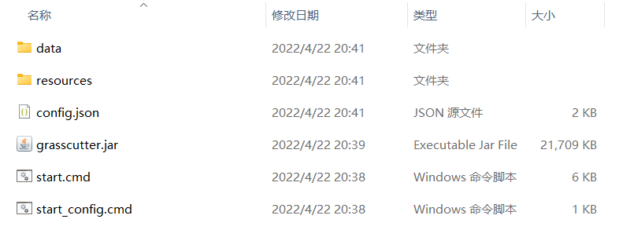
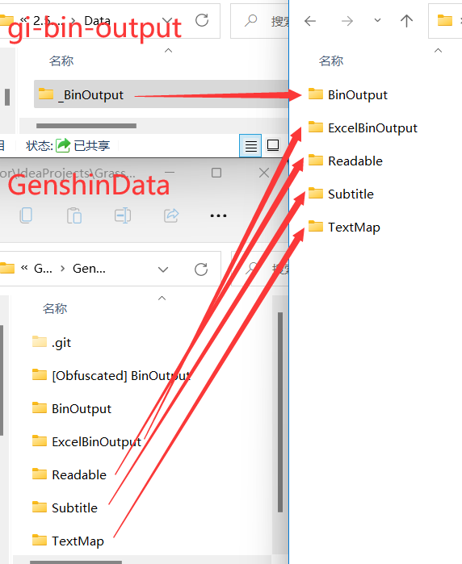
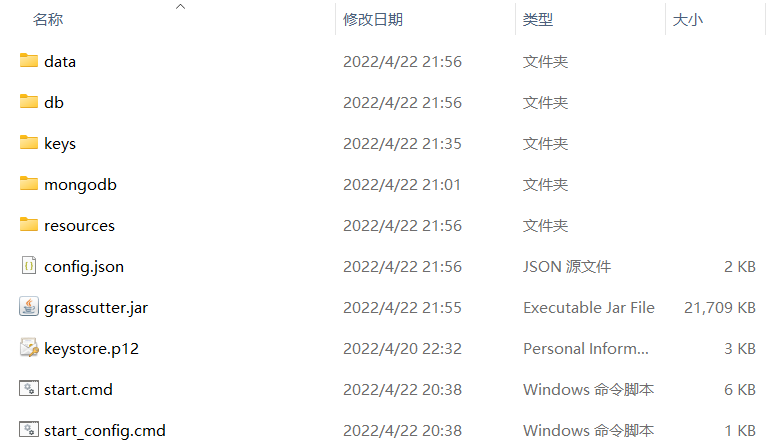
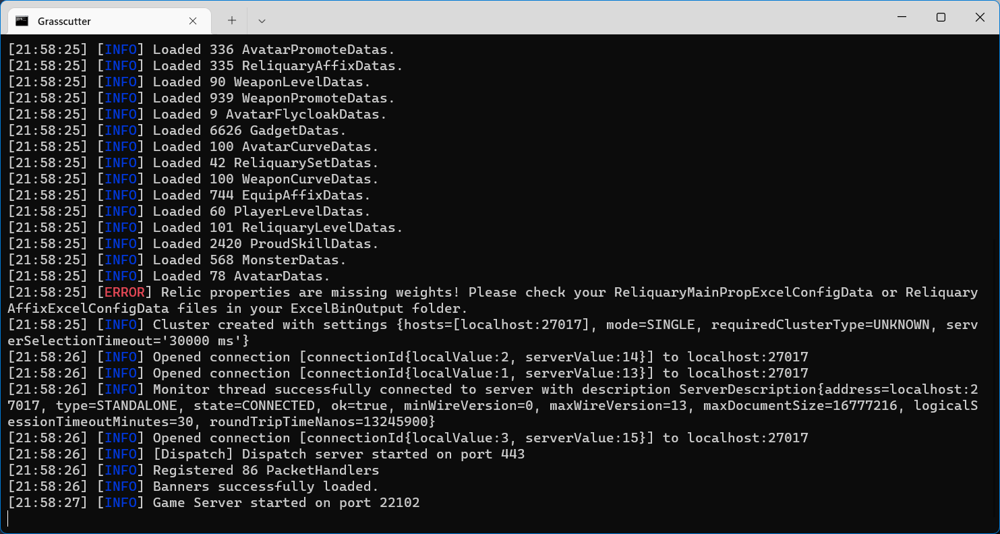

# 🛠 Backend

### 先决条件

* JDK-8u202 [下载链接](https://mirrors.huaweicloud.com/java/jdk/8u202-b08/)
* MongoDB [下载链接](https://www.mongodb.com/download-center/community/releases)（建议使用4.0+版本）
* 代理服务 mitmproxy (mitmdump, recommended), Fiddler Classic, etc.

### 启动服务器

[在此](https://github.com/Grasscutters/Grasscutter/releases) 下载 `grasscutter.jar` 并放置到任意位置。

运行该文件一次后，服务器会自动关闭并生成配置文件与_不完整的_目录结构。




有关配置文件的修改，详见服务器配置篇。



[server-config.md](../advanced/server-config.md)


配置MongoDB。在本实例中，MongoDB可执行文件位于`.\mongodb\mongod.exe`，数据库位于`.\db`。

运行`mkdir db && .\mongodb\mongod.exe --dbpath .\db` 以初始化数据库。

下载 [GenshinData](https://github.com/Dimbreath/GenshinData) 仓库和 [gi-bin-output](https://github.com/radioegor146/gi-bin-output) 仓库并按图示放置资源文件。


文件版本需要与你的游戏版本相对应，否则可能会出现不可预料的错误。

对于GenshinData，文件版本见Commit记录，最新的Commit对应最新的游戏版本。

对于gi-bin-output，文件版本见第一层目录下的文件夹名。




此外，你还需要从Grasscutter主项目获取部分资源：

1. [Keys](https://github.com/Melledy/Grasscutter/tree/main/keys) -> `keys`
2. [Game Data](https://github.com/Melledy/Grasscutter/tree/main/data) -> `data`
3. [The Keystore File](https://github.com/Melledy/Grasscutter/blob/main/keystore.p12) -> `keystore.p12`

最终结果如图：



现在可以尝试启动服务器了：

```batch
.\mongodb\mongod.exe --dbpath .\db
# 在另一个窗口启动服务器或双击脚本文件
.\start.cmd
```



Mosi mita! You've done it!
